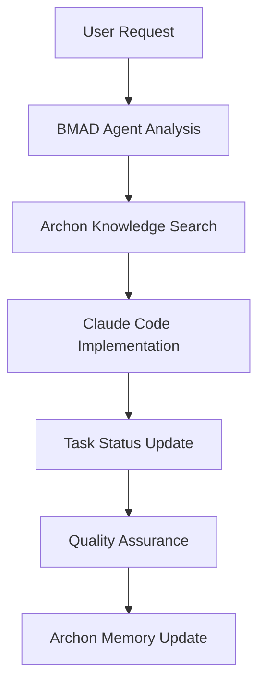

# Personal Guide 🎯

> AI-powered personal assistant with enhanced knowledge management and intelligent development workflows

[](https://railway.app/template/personal-guide)

## ✨ Features

### 🧠 Enhanced AI System
- **Multi-Persona AI**: Choose from Mentor, Coach, Friend, or Mirror personalities with advanced context switching
- **Claude Code Integration**: AI-powered development assistance with specialized agents
- **Archon OS Knowledge Base**: Persistent memory and intelligent task management
- **BMAD Methodology**: Structured development with analyst, architect, dev, and QA agents
- **Natural Language Processing**: Advanced mood analysis and pattern recognition

### 📊 Comprehensive Tracking
- **Habit Tracking**: Visual progress, streak calculations, and analytics
- **Mood & Energy Logging**: Correlate emotions with activities and habits
- **Journal System**: Integrated journaling with mood correlation and insights

### 🎨 Modern Interface
- **Progressive Web App**: Install on mobile devices for native app experience
- **Responsive Design**: Works seamlessly on desktop, tablet, and mobile
- **Real-time Updates**: Live data synchronization and animations

### 🏗️ Advanced Development Infrastructure
- **DevOps Pipeline**: Complete CI/CD with GitHub Actions
- **AI-Powered Development**: Intelligent coding assistance and code review
- **Knowledge Management**: Archon OS for project memory and decision tracking
- **Agent Orchestration**: BMAD system with specialized development agents
- **Monitoring**: Prometheus/Grafana integration for performance tracking
- **Security**: Comprehensive error tracking and secrets management

## 🚀 Quick Deploy to Railway

1. Click the "Deploy on Railway" button above
2. Connect your GitHub account
3. Add environment variables:
   ```
   # Required: Supabase Configuration
   NEXT_PUBLIC_SUPABASE_URL=your_supabase_url
   NEXT_PUBLIC_SUPABASE_ANON_KEY=your_supabase_anon_key
   SUPABASE_SERVICE_ROLE_KEY=your_service_role_key

   # AI Providers (at least one required)
   OPENAI_API_KEY=your_openai_api_key
   ANTHROPIC_API_KEY=your_claude_api_key  # For Claude fallback
   ```
4. Deploy and enjoy!

## 🛠️ Local Development

### Prerequisites
- Node.js 18+
- PostgreSQL (or Supabase account)
- OpenAI API key (recommended) or Anthropic Claude API key
- Archon OS (optional, for enhanced knowledge management)
- Claude Code CLI (for AI-assisted development)

### Setup

1. **Clone the repository**
   ```bash
   git clone https://github.com/Gbenro/personal-guide.git
   cd personal-guide
   ```

2. **Install dependencies**
   ```bash
   npm install
   ```

3. **Set up environment variables**
   ```bash
   cp .env.local.example .env.local
   # Edit .env.local with your keys
   ```

4. **Set up database**
   ```bash
   # Run the Supabase schema
   # Import supabase-schema.sql into your Supabase project

   # Optional: Set up beliefs, goals, and routines tables
   # Import migration files from apps/web/src/database/migrations/
   ```

5. **Optional: Start Archon OS (Enhanced Knowledge Management)**
   ```bash
   # If using Archon OS for project memory
   # Follow Archon setup instructions
   # Default: http://localhost:3737
   ```

6. **Start development server**
   ```bash
   npm run dev
   ```

7. **Open your browser**
   ```
   http://localhost:3000
   ```

## 📱 PWA Installation

### Mobile (iOS/Android)
1. Open the app in your mobile browser
2. Look for "Add to Home Screen" prompt
3. Follow the installation steps

### Desktop
1. Look for the install icon in your browser's address bar
2. Click to install as a desktop app

## 🧠 Enhanced AI Development System

### Archon OS Integration
**Knowledge Management & Project Memory**
- **Web Interface**: http://localhost:3737 - Visual knowledge base management
- **API Endpoint**: http://localhost:8181 - Programmatic access to project data
- **Features**:
  - Persistent project memory and decision tracking
  - Code example search and RAG (Retrieval-Augmented Generation)
  - Task management with pipeline synchronization
  - Technical decision logging with rationale

### BMAD Agent System
**Structured Development Methodology**
- **`*analyst`** - User research and requirements analysis
- **`*architect`** - System design and AI architecture planning
- **`*dev`** - Feature development and implementation
- **`*qa`** - Quality assurance and comprehensive testing
- **`*ux-expert`** - User experience design and optimization

### Claude Code Specialized Agents
- **`pg-orchestrator`** - Master project coordinator with Archon sync
- **`pg-ai-specialist`** - AI/ML implementation and Claude API integration

### Development Workflow Integration


## 🏗️ Architecture

### Enhanced Tech Stack
- **Frontend**: Next.js 15, React 19, TypeScript, Tailwind CSS
- **Backend**: Supabase (PostgreSQL + Auth + Real-time)
- **AI Core**: OpenAI GPT-4/Claude with multi-persona system
- **AI Development**: Claude Code with specialized sub-agents
- **Knowledge Base**: Archon OS for persistent memory
- **Development**: BMAD methodology with agent orchestration
- **State Management**: Zustand with persistence
- **Deployment**: Railway with Docker containerization

### Core Application Features
- **Multi-persona AI chat** with intelligent personality switching
- **Comprehensive tracking** - Habits, moods, beliefs, goals, routines
- **Advanced analytics** with trend visualization and correlations
- **Journal integration** with mood correlation and AI insights
- **PWA capabilities** for native mobile app experience

### Advanced Development Features
- **AI-powered development** with Claude Code integration
- **Intelligent task management** via Archon OS
- **Agent-based development** with BMAD methodology
- **Persistent project memory** and decision tracking
- **Automated code review** and quality assurance
- **Production monitoring** and comprehensive error tracking

## 🔧 Configuration

### Environment Variables
```bash
# Supabase Configuration (Required)
NEXT_PUBLIC_SUPABASE_URL=your_supabase_project_url
NEXT_PUBLIC_SUPABASE_ANON_KEY=your_supabase_anon_key
SUPABASE_SERVICE_ROLE_KEY=your_supabase_service_role_key

# AI Configuration (At least one required)
OPENAI_API_KEY=your_openai_api_key         # Primary AI provider
ANTHROPIC_API_KEY=your_claude_api_key      # Claude API for development agents

# Enhanced Development (Optional)
ARCHON_API_URL=http://localhost:8181       # Archon OS API endpoint
ARCHON_WEB_URL=http://localhost:3737       # Archon OS web interface
GH_TOKEN=your_github_token                 # GitHub integration

# Optional: Monitoring
NEXT_PUBLIC_SENTRY_DSN=your_sentry_dsn
NEXT_PUBLIC_DATADOG_API_KEY=your_datadog_key
```

## 🛠️ Enhanced Development Workflow

### AI-Assisted Development Process

1. **Task Analysis**
   ```bash
   # Use BMAD analyst for requirements
   *analyst "Analyze user authentication requirements"
   ```

2. **Architecture Planning**
   ```bash
   # Use BMAD architect for system design
   *architect "Design secure authentication system"
   ```

3. **Knowledge-Based Implementation**
   ```bash
   # Search existing patterns in Archon
   archon:search_code_examples("authentication patterns")

   # Implement with Claude Code agents
   pg-ai-specialist "Implement Claude API integration"
   ```

4. **Quality Assurance**
   ```bash
   # Comprehensive testing with BMAD QA
   *qa "Test authentication system security"
   ```

5. **Memory & Documentation**
   ```bash
   # Log decisions in Archon
   *remember "Authentication design decision" architecture
   ```

### Agent Communication Examples
```bash
# Direct agent handoff with context
*handoff analyst architect "Requirements complete, design needed"

# Project status overview
*status

# Recall previous decisions
*recall authentication
```

## 🚢 Deployment

### Railway (Recommended)
1. Connect your GitHub repository to Railway
2. Set environment variables in Railway dashboard
3. Deploy automatically on every push

### Docker
```bash
docker build -t personal-guide .
docker run -p 3000:3000 personal-guide
```

### Manual
```bash
npm run build
npm start
```

## 🤝 Contributing

1. Fork the repository
2. Create a feature branch (`git checkout -b feature/amazing-feature`)
3. Commit your changes (`git commit -m 'Add amazing feature'`)
4. Push to the branch (`git push origin feature/amazing-feature`)
5. Open a Pull Request

## 📄 License

This project is licensed under the MIT License - see the [LICENSE](LICENSE) file for details.

## 🙏 Acknowledgments

- **AI Development**: Built with [Claude Code](https://claude.ai/code) and specialized agents
- **Knowledge Management**: Powered by [Archon OS](https://archon.os) for persistent memory
- **AI Models**: [OpenAI](https://openai.com) GPT-4 and [Anthropic](https://anthropic.com) Claude
- **Development Methodology**: [BMAD](https://bmad.ai) structured agent system
- **Database**: [Supabase](https://supabase.com) for real-time data
- **Deployment**: [Railway](https://railway.app) with GitHub integration

---

**Start your personal growth journey today!** 🌱